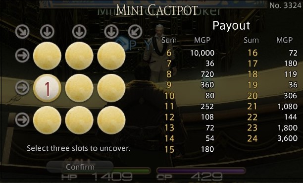

# 第5次練習題目-練習-PC5
[deadline 期末前兩周](#)
>撰寫前請注意

1. 請[點選](https://github.com/altoliaw3/111-1PC5.git)該連結連結至題目之倉庫，並對該倉庫進行fork
2. 再藉由上述所提供的連結，把該fork至自己帳號的倉庫clone至本機端，
再進行程式撰寫與文件撰寫

> 正題

請在專案(方案)下，建立一個Test.aspx頁面，並在Test.aspx.cs的page_load方法與題目下方的**限制1**，解決下面問題。
某遊戲中有一刮彩券的小遊戲，其彩券上有 3 X 3 的正方形格子。
每個格子內會有1至9數字分布在內，且所有數字不會重複出現。
每個購買彩券的人，都可隨意刮出4個格子後，決定要如何連線，連線方式如下圖中箭頭方向所示，
共八條(見圖中的灰色箭頭個數)。透過連線的格子內數字「和」，對應下圖中的Payout內的值，
可以得到對應的錢。如假設某連線個內數字之和為15，則可獲得80元。

假設今日彩卷內所有的格子數字值全部明示，依照陣列由左至右，由上至下為索引方法其陣列內值為：
7, 8, 9, 1, 4, 3, 2, 5, 6。
請算出該張彩券連線中，可以獲利最多錢與最少錢的和各為多少？

**限制1：** 在Test.aspx.cs中需自行撰寫用來判斷最多錢的方法命名為mt_GetMost以及
判斷最少錢的方法為mt_GetLeast；兩種方法參數只能傳入彩券9格陣列本身。

> 補充說明 (以下各項全需滿足，才會進行評分)

1. 請將完成程式後，撰寫書面內容寫於answer.md
2. 將將該answer.md檔藉由markdown editor 顯示部分，按右鍵進行列印成pdf檔案，
檔名需為answer.md.pdf
3. 將answer.md.pdf檔於[CleverPDF](https://www.cleverpdf.com/zh-tw/encrypt-pdf)進行**防拷貝**，
並將防拷貝後的answer.md.pdf放置至專案下並拖入VS community IDE內的「**方案總管**」
4. 將answer.md使用winrar加密打包，請自己記住密碼，
並於VS community IDE內的「**方案總管**」刪除answer.md檔案
5. 將專案執行git add、commit、push至github後，並於
[google sheet(點我)](https://docs.google.com/spreadsheets/d/11S9usP9IYR_FqUlQTS4AisvjZMdqrdZuUU9YREpPwxQ/edit#gid=1994410359)中找尋相對應之試算表，
並於該位同學位置註記同學之倉庫的url

>該次作業完成預計所需時間 (實作與文件撰寫所需要完成時間) 

* 100 mins 以下：專精
* 介於 100 至 130 mins：熟練
* 介於 130 至 210 mins：平均
* 超過 210 mins：不熟，請多花心思在課業上

